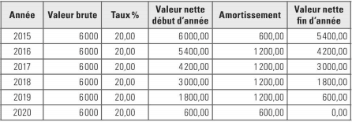
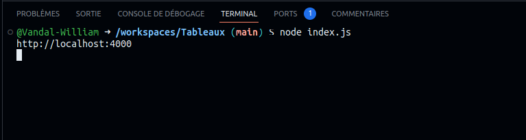
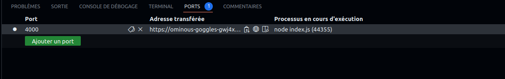

# Tableaux 

## Consigne :

Reproduiser le tableau ci dessous en html



## Avant de commencer 

taper cette commande dans le terminal

```git
    node index.js
```



Pour afficher le résultat de l'exercice dans le navigateur, aller dans PORTS et cliquez sur le rond  => 

